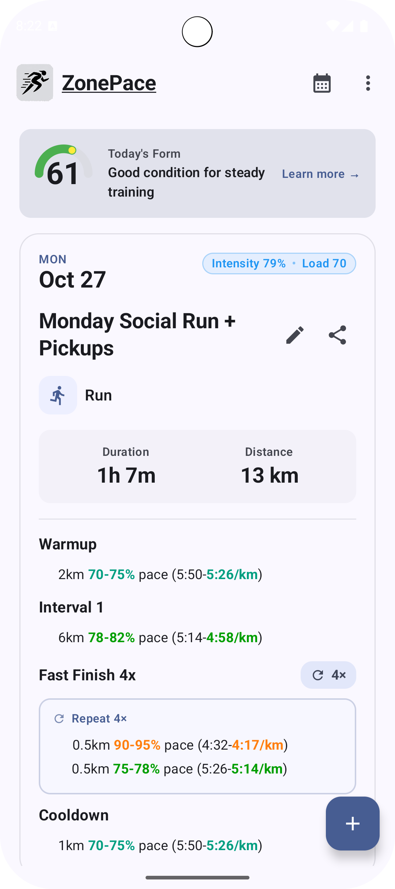

k# ZonePace

A modern Android app for managing and tracking your interval training workouts with [Intervals.icu](https://intervals.icu).

  

> ℹ️ **Public issue tracker only**  
> This repository does not contain the ZonePace source code. Use it to report bugs, request features, and follow progress updates for the mobile app.

## Features

- **Smart Intervals.icu Sync**: Keep your plan current with automatic athlete resolution and background refreshes.
- **Calendar & List Planning**: Jump between calendar and list views to plan the week with sport icons and intensity highlights.
- **On-Device Workout Editing**: Create or adjust workouts using Markdown, templates, and sport-aware helpers.
- **Training Load Insights**: Review ATL, CTL, stress balance, and form scores in a dedicated analytics sheet.

## Report an Issue

Before opening a new ticket:

- Search existing issues (open and closed) to avoid duplicates.
- Gather reproduction steps, expected vs. actual results, and screenshots/logs if available.
- Include your device model, Android version, ZonePace build, and Intervals.icu athlete ID (if relevant).

When you are ready, click **New issue** and choose the template that best matches your report.

## Request a Feature

- Describe the problem you want to solve rather than just the solution.
- Call out any workflows that block you today.
- Attach mockups or links to related training tools if they clarify the idea.
- Tag requests with the appropriate labels (e.g., `enhancement`, `ui`, `workout-editor`) to help triage.
